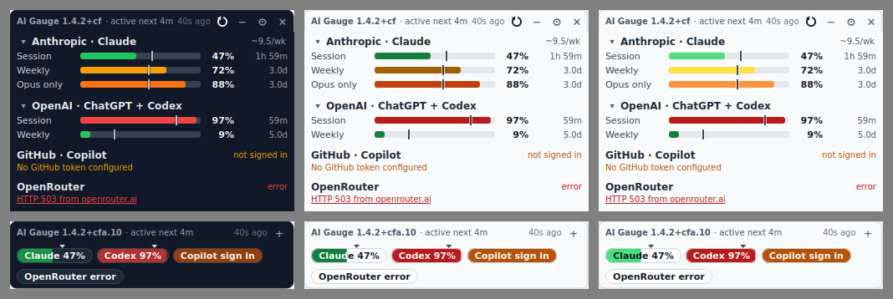

# Colour scheme: dark / light / system — research

**Status:** research for the 1 November 2026 review. Nothing here is built.
**Asked for:** "another toggle for dark/light/system colour schemes" (the maintainer, 2026-10-02).
**Read with:** [`zoom-toggle.md`](zoom-toggle.md) — the two controls sit together and share their
first PR.
**Measured against:** `main` at `5f09a55`, 1.4.2+cfa.10. Installed: Qt 6.11.2 runtime, PyQt6
6.11.0, QtWebEngine 6.11.2 (Chromium 140). `pyproject.toml` requires `PyQt6>=6.7`; CI installs the
latest. Line numbers are as of `5f09a55`. 1.4.3+cfa.11 has since moved `config.py` (by 8 to 38
lines from line 55 on) and two test files; the `widget.py`, `app.py` and `settings_dialog.py`
citations are unchanged.



*Left: today. Middle: a prototype light theme. Right: light with pale custom gauge colours — the
reason for the contrast hint in §5.*

## 1. What exists today

### 1.1 The colour inventory

The app is dark-only, and every colour is written into the code as a literal. Counted with a
tokenizer pass over every string and comment in `src/aigauge/**/*.py`
(`python3 docs/research/theme/inventory.py src/aigauge`; quick check:
`grep -roE '#[0-9a-fA-F]{6}\b|#[0-9a-fA-F]{3}\b' src/aigauge --include='*.py' | wc -l` → 193):

- **193** hex literals: 187 in top-level modules and 6 in `webview/login_window.py`.
  - **4** are in comments or docstrings (`ui_style.py:3–4`, `widget.py:425`, and the QSS comment
    at `settings_dialog.py:126`).
  - That leaves **189 live**, with **24 distinct values**.
- By file: widget 57, settings_dialog 50, ratio_dialog 23, cookie_dialog 20, error_dialog 14,
  ui_style 7, login_window 6, menubar 5, config 4, app/gauge/macos_status_item 1 each.
- On top of those:
  - **3 RGBA `QColor` tuples** (pace notch, tick and shadow: `widget.py:639, :839, :840`).
  - **1 derived colour**: the chip fill is the band colour `.darker(135)` (`widget.py:296`).
  - **62 `setStyleSheet` calls**: widget 38 (one is the forwarder at `widget.py:895`), ratio 10,
    login 5, settings 4, cookie 3, error 2.
  - **11 rich-text `style='color:…'` sites** (links and error spans). These are redrawn by
    `setText`, not by a stylesheet.

| Role | Count | Values |
|---|---|---|
| Text primary | 32 | #f3f4f6 17, #e5e7eb 14, #f9fafb 1 |
| Text secondary | 28 | #9ca3af 23, #d1d5db 3, #cbd5e1 2 |
| Text muted | 14 | #6b7280 |
| Text on a colour fill | 2 | #111827 (swatch), #374151 (login notice) |
| Surface: panel/field | 13 | #111827 |
| Surface: dialog | 10 | #1f2937 |
| Surface: control/track/hover | 20 | #374151 12, #4b5563 6, #6b7280 2 |
| Scroll handle states | 3 | #4b5563, #6b7280, #9ca3af |
| Border/divider | 17 | #374151 10, #4b5563 6, #1f2937 1 |
| Accent (default button, focus, selection, slider) | 18 | #2563eb 7, #1d4ed8 6, #3b82f6 5 |
| Link / chart | 8 | #60a5fa 7, #93c5fd 1 |
| Error text | 8 | #ef4444 6, #dc2626 2 |
| Warning (text, chip fill, notice) | 4 | #f59e0b 2, #92400e, #fef3c7 |
| Setup dot (menu bar) | 1 | #38bdf8 |
| Gauge band defaults | 7 | config.py:303–306, menubar.py:31–33 |
| Gauge neutral, "no data" | 4 | #6b7280 (gauge.py:21, menubar.py:35, macos_status_item.py:46, app.py:259) |
| Comments | 4 | — |

Of the 189 live literals, **165** are interface colours that depend on the theme, **13** are status
colours that need a light variant, and **11** are data colours.

**Swapping value for value cannot work.** `#374151` has three roles (border, track/button, and
text on the amber notice); `#6b7280` has four (muted text, pressed button, scroll hover, the neutral
gauge dot); `#1f2937` is both the dialog background and the panel's edge pen. The refactor has to go
call site by call site, by role.

### 1.2 How colour reaches the screen

- **Two kinds of stylesheet.** Some are set once in a constructor (header labels, buttons, the tile
  container). Others are set again on every snapshot: bar chunks `widget.py:1007`, status tag
  `:1393–1443`, detail line `:480`, cadence `:2197–2219`. The second kind redraws whenever a
  snapshot is re-delivered; `apply_gauge_colors()` (`widget.py:2448`) already does this when gauge
  colours change, so there is a precedent.
- **Custom painters:** `_SummaryChip` (`:626`), `_PaceTickOverlay` (`:838`), the panel background
  (`:3014`), the ratio sparkline (`ratio_dialog.py:76`), the hand-drawn refresh icon (`widget.py:559`), and
  Settings' chevrons — drawn once in `#cbd5e1` and **written to `app_data_dir()/cache`** for
  `image: url()` (`settings_dialog.py:258`).
- **The app sets no style and no palette.** `app.py:2954` creates the `QApplication` and stops
  there, so Windows and macOS get the native style and Linux gets Fusion. Anything without a
  stylesheet follows the OS: the tray menu (`app.py:2536`), the two message boxes parented to the
  panel (`app.py:2765, :2772`), tooltips, and the login window frame. Message boxes and the
  `QColorDialog` parented to a dialog inherit that dialog's dark stylesheet (measured offscreen:
  `#1f2937` background, against `#efefef` for a box parented to the panel).
- **The panel must never get a stylesheet of its own** (`widget.py:1762`), because it would
  cascade into child dialogs.
- **macOS menu bar and icons.** `menubar.py:150` accepts `is_dark` and ignores it; it should stay
  unwired. The macOS status item draws its text in `NSColor.labelColor()`
  (`macos_status_item.py:86`), so it already follows the menu bar. The app icon is a dark tile with
  its own background, so it reads on any taskbar.
- **A scheme change touches no geometry.** No font, padding or size is part of a token, so auto-fit,
  the remembered size and the 260 px floor are unaffected. The prototype's dark and light renders
  are both 340×241.

### 1.3 Contrast, computed

WCAG 2.x relative luminance (`python3 docs/research/theme/contrast.py`). The default band colours
are tuned for a dark background:

| Band | Dark track #374151 | Light track #e5e7eb | White |
|---|---|---|---|
| green #22c55e | 4.52 | **1.84** | 2.28 |
| yellow #f59e0b | 4.80 | **1.73** | 2.15 |
| orange #f97316 | 3.68 | **2.26** | 2.80 |
| red #ef4444 | **2.74** | 3.04 | 3.76 |

- **Bands on light:** every default except red fails WCAG 1.4.11's 3:1 for graphics against a light
  track.
- **Text on white:** `#9ca3af` 2.54, `#60a5fa` (link) 2.54, `#f59e0b` (warning) 2.15, `#ef4444`
  (error) 3.76 — all below 4.5.
- **Pace tick:** `#f3f4f6` at alpha 180 is 1.09:1 on a light track, so it disappears.

**Weak spots already in the dark theme** (noted, not fixed): red against the track 2.74; muted
`#6b7280` on `#111827` 3.67, and 3.04 on the dialog's `#1f2937`, on small text; error `#ef4444` on the dark dialog 3.90; chip text
`#f9fafb` on the darkened green and yellow fills 3.83 and 3.65.

**Light colours that pass**, against the `#e5e7eb` track:

- **Bands:** green-700 `#15803d` 4.05, yellow-700 `#a16207` 3.98, orange-700 `#c2410c` 4.18,
  red-700 `#b91c1c` 5.23. White text on each is at least 4.92.
- **Text** (on `#f9fafb` unless stated): `#111827` 16.98, `#4b5563` 7.23, `#6b7280` 4.63, link
  `#1d4ed8` 6.41, error `#b91c1c` 6.19, warning `#b45309` 4.81.
- **The cost:** on light, yellow-700 and orange-700 are both brownish and close in hue. Every bar
  has its percentage beside it, so colour remains a backup cue (WCAG 1.4.1), but the bands are
  harder to tell apart.

**Tray dot on a Windows 11 taskbar** (taskbar colours assumed, unverified: `#f3f3f3` light,
`#202020` dark):

| Dot | Light taskbar | Dark taskbar |
|---|---|---|
| Yellow | 1.94 | 7.59 |
| Green | 2.05 | 7.15 |
| Neutral grey | 4.36 | 3.37 |

## 2. Qt mechanisms, as installed

Run on Qt 6.11.2:

| Environment | `colorScheme()` | `setColorScheme(Dark)` | `colorSchemeChanged` |
|---|---|---|---|
| offscreen (CI) | Unknown | ignored | never |
| xcb under Xvfb, no theme plugin | Unknown | ignored | never |
| xcb + `xdgdesktopportal`, no D-Bus | Unknown | ignored | never |
| xcb + `gtk3` theme | Light | works: palette `#efefef`→`#323232`, signal and `paletteChanged` | yes |

- **Reverting:** `setColorScheme(Unknown)` goes back to the system scheme (verified under gtk3);
  `unsetColorScheme()` is documented to do the same. Qt documents the override as "a hint… not
  supported on all platforms", and it never overwrites palette entries the app set itself.
- **Linux can disagree with itself.** With `gtk-theme-name=Adwaita-dark` in `settings.ini`,
  `colorScheme()` reported Dark while the palette stayed light (`#faf9f8`). With
  `GTK_THEME=Adwaita:dark`, both were dark. Guessing the scheme from palette lightness is not a
  useful fallback.
- **Tests can fake an OS change.** `colorSchemeChanged` can be emitted from Python, but
  `colorScheme()` still reads Unknown afterwards, so the handler must take the scheme from the
  signal's argument.
- **QtWebEngine:** `prefers-color-scheme` follows Qt's resolved scheme, including an app override,
  but only from the next page load, not live (gtk3; waited 1.5 s). Offscreen it is always light.
  `ForceDarkMode` exists but auto-darkens the page, which is not wanted on a third-party sign-in
  page.
- **QSS `palette(role)` is read once, when the stylesheet is applied.** After `app.setPalette()`, a
  label kept its old colour until its stylesheet was set again.
- **Version:** `setColorScheme` needs Qt 6.8, and the dependency floor is 6.7, so the call needs a
  `hasattr` guard.
- **Unverified, because the research host had no Windows or Mac:** Windows (registry
  `AppsUseLightTheme`, `WM_SETTINGCHANGE`) and macOS (`NSApp.appearance`) are expected to honour the
  override. The Windows taskbar follows `SystemUsesLightTheme`, which Qt does not expose. Open risk:
  whether setting `NSApp.appearance` also changes the macOS status item's `labelColor`; that text
  must keep following the menu bar.

## 3. Choosing the mechanism

**A. A token table, with stylesheets re-rendered on change.** Recommended, and prototyped
(`theme/theme_prototype.py`, `theme/prototype-widget.diff`, `theme/prototype-ui_style.diff`, all
against `5f09a55`).

- **Tokens:** a new `theme.py` holds two frozen tables of about 45 named colour roles, one dark and
  one light.
- **Templates:** every inline stylesheet becomes a `string.Template` with `$token` placeholders.
  QSS uses braces and never `$`, so nothing needs escaping.
- **`styled(widget, template)`** applies the template and stores it on the widget as a dynamic
  property.
- **On a scheme change**, the app walks `QApplication.allWidgets()`, re-renders each stored
  template and calls `update()`. Custom painters read the current tokens (`tok()`) at paint time.

**B. QPalette with the Fusion style.** Rejected. Eleven greys do not map onto palette roles
without losing distinctions; `palette()` in a stylesheet still needs the same re-apply as A; every
literal still has to be rewritten and painters still need explicit colours; and forcing Fusion
changes the native look of every message box and menu on Windows and macOS.

**C. Two complete stylesheet sets.** Rejected. Eight call sites build their stylesheet at runtime
around a band or status colour (`widget.py:480, :1007, :1015, :1175, :2218, :2219`,
`settings_dialog.py:559`, `ratio_dialog.py:310`), so the sheets cannot be swapped as a set; every
later colour change becomes two edits; painters are not covered.

**What the prototype showed** (on a `git archive` export: `theme.py` 128 lines, a scripted rewrite
of `widget.py`'s 57 sites and 37 `setStyleSheet` calls, and the `ui_style.py` scroll bars):

- Dark render against unmodified `5f09a55`: **0 differing pixels**, panel and chip strip.
- Built dark then switched live to light, against built light: **0 differing pixels**.
- A live switch with Settings open (about 340 widgets, 67 templated) takes 30–40 ms.
- The full suite passes on the prototype tree: **2 139 tests**, all of them at `5f09a55`.

The renders and the timing were taken with a driver that is not committed; the prototype tree itself
is rebuilt with the recipe at the end of this document.

## 4. What follows the scheme, and what cannot

| Surface | Today | With this design |
|---|---|---|
| Panel, chips, macOS popover (the popover *is* the panel) | dark literals | tokens, live |
| Settings, gauge colours, cookie, error and ratio dialogs | dark literals per dialog | templated and live while open; their 9 rich-text sites (6 links, 3 spans) update on reopen |
| Message boxes and `QColorDialog` parented to a dialog | inherit the dialog's stylesheet | follow it |
| Message boxes on the panel (`app.py:2765, :2772`), tray menu, tooltips, window title bars | OS palette | `setColorScheme` on Qt ≥ 6.8 where the platform honours it; otherwise the OS |
| Settings chevrons | one PNG pair | one pair per scheme, same cache folder |
| Login window frame | no stylesheet; literals on the native background | dialog stylesheet, tokens |
| Sign-in page content | follows the OS (light offscreen) | follows the app's choice from the next page load, where supported |
| Tray dot, menu-bar dots | band colours | unchanged — the taskbar and menu bar belong to the OS; an outline ring is a separate follow-up |
| macOS status-item text | `labelColor` | unchanged; check on a Mac |
| App icon | dark tile | unchanged |

## 5. Gauge colours under a light theme

`ColorThresholds` stores explicit `#rrggbb` strings, and the defaults are written to the config
file too, so "never customised" cannot be told apart from "chose `#22c55e`".

**Recommended rule** (prototyped as `theme.band_color`): a stored colour equal to the dark default
is drawn as the light default in the light theme; any other colour is the user's choice and is used
as-is in both schemes. Someone who deliberately picked a default exactly gets the theme's version,
which is the right result anyway.

**Custom colours are where light hurts.** A pale yellow `#fde047` is 1.06:1 against the light
track, so the bar cannot be told from its track (right-hand panel above). Three changes follow:

- **Contrast hint:** Settings' colour dialog shows "low contrast on light" beside any swatch below
  3:1 against the current scheme's track.
- **Swatch text:** whichever of white or near-black reads better, instead of the fixed `#111827`
  (`settings_dialog.py:560`).
- **Chips on light:** the fill is the band colour and the label is split — dark text over the
  unfilled part, and over the fill whichever of white or near-black has more contrast.

**Tray and menu bar** keep the stored colours, so in the light theme the panel's yellow
(`#a16207`) and the tray's (`#f59e0b`) are different shades. Storing a second set of user colours
per scheme would double `ColorThresholds`; not recommended.

## 6. The control

**Placement.** The user wants the controls bottom-right, which is where `_edges_for_point`
(`widget.py:137`) puts the bottom-right resize corner, with `RESIZE_BAND = 8` (`:103`). A
`QPushButton` takes its own mouse press, so any part of a button inside that band would leave the
resize corner dead there. **Rule:** both controls go in one footer row whose right and bottom
margins are at least `RESIZE_BAND`, and `edges_at()` must be empty at every corner of every footer
button. Not the header: there is no room — the title already clips to "AI Gauge 1.4.2+cf" at 340 px.

**Cycle or menu.** A three-state cycle always has a step that does nothing or flashes the wrong
scheme: on Dark with a dark OS, clicking to "System" changes nothing visible; going from Light to
System on a light OS passes through Dark, so the whole UI flashes. **Recommended:** one 20×20 button
that opens a three-item menu (Match system / Light / Dark) with the current choice checked. Two
clicks, but each does exactly what it says. The menu gets a templated stylesheet so it matches the
panel.

**Icon.** Show the *setting*, not the current look: a half-filled circle for System, a sun for
Light, a crescent for Dark. Hand-painted like `_render_refresh_pixmap`, in the secondary and strong
text tokens, redrawn on change and sized by the zoom factor. (The Unicode ☀/☾ glyphs may render as
colour emoji on Windows — unverified.) Tooltip: "Colour scheme: Match system (dark now)".

**Other places to change it.**

- **Tray menu:** a "Colour scheme ▸" submenu. Covers a collapsed or hidden panel and macOS
  menu-bar mode.
- **Settings › General:** a combo beside UI scale (`settings_dialog.py:777`). Settings writes the
  field only if its own combo was changed — otherwise a Settings window left open would overwrite a
  change made from the panel.

**Collapsed chip strip:** the footer hides; the tray submenu covers it.

**Shared with the zoom feature** (see [`zoom-toggle.md`](zoom-toggle.md)):

- **One stylesheet helper and one restyle seam.** Both features rewrite the 37 stylesheet calls in
  `widget.py` (34 of them carry both a colour and a px value); the theme also rewrites the 24 in the
  dialogs and login window, which zoom leaves at OS size. `docs/ui-scale-widget-only-plan.md`
  already proposes a `qss()` wrapper that rewrites px values. Make it **one** helper —
  `styled(widget, template)` renders colour tokens *and* zoomed px and remembers the template — and
  one `restyle_all()`, which a scheme change and a zoom change both call: it re-renders every
  remembered template, then calls each panel class's `_restyle()` (zoom-toggle.md §5: fixed sizes,
  margins, `fontMetrics` widths), then re-delivers each tile's snapshot. Land it with today's dark
  tokens at zoom 1.0 as the shared first PR (§9, PR 1).
- **One footer row**, margins of at least `RESIZE_BAND`, counted in `_refit_height`, hidden when
  collapsed.
- **The theme icon takes a `size`**, so it scales with zoom.
- **`color_scheme`, and zoom's one-shot migration bool, in `WindowState`**, beside `ui_scale` and
  `opacity`, with validators that coerce bad values to a default and never raise.

## 7. Recommended design

1. **`theme.py`:** the `DARK` table (exactly today's values) and the `LIGHT` table, plus `tok()`,
   `qss()` (token substitution; in the shared helper it also scales px, §6), `styled()`,
   `band_color()` and a `ColorSchemeController(QObject)` with a `changed(str)`
   signal.
2. **Resolution:** an explicit Light or Dark setting wins. "System" uses the last scheme Qt
   reported — the initial `colorScheme()`, then each `colorSchemeChanged` argument. Unknown resolves
   to **dark**, today's look.
3. **Native parts follow** on Qt ≥ 6.8 (guarded by `hasattr`): an explicit choice calls
   `styleHints().setColorScheme(Light|Dark)`; "System" calls `unsetColorScheme()` before reading the
   system value.
4. **Live everywhere, no restart:** templates re-render; `UsageWidget._on_theme_changed` redraws the
   refresh and theme icons and re-delivers each tile's snapshot (which redraws the rich-text status
   and ratio links); open dialogs re-render their stylesheets; chevrons are drawn per scheme.
5. **Painters:** chip, pace tick, panel background and edge, sparkline. On light, the pace tick is
   `#111827` at alpha 200 with a white shadow: 7.78:1 on the light track.

**Config and the security mandate.** One new field, `window.color_scheme`, a string in
`{"system", "light", "dark"}`.

- **Validation:** a `@field_validator(mode="before")` accepts only a string exactly in the set.
  Anything else (non-string, wrong case, 10 000 characters, a dict) becomes the default, with a
  warning logged through `_safe_repr`. It never raises, so `Config.load()` and `_salvage` are
  unaffected.
- **No stylesheet injection:** the value only selects one of two constant tables. The only
  config-derived strings in any stylesheet remain the band colours, cleaned through
  `QColor(...).name()` as today.
- **Defaults:** **system** for a new install; `_migrate` (`config.py:989`) writes **dark** into an
  existing file that lacks the key, so nobody's panel changes on upgrade (open question 1).
- **No dependency, no network.** **File writes:** only two more chevron PNGs in
  `app_data_dir()/cache`. **Logs:** `color_scheme setting=… effective=… source=system|explicit`,
  nothing about accounts.
- **Write path:** the panel's menu emits a fixed value; `App` assigns it through the same coercion
  and calls `config.save()`.

## 8. Test plan

Everything runs offscreen. `colorScheme()` is Unknown there, so no test relies on Qt detecting a
scheme.

1. **Validator:** each bad input becomes the default without raising; a bad value next to good
   settings keeps them; save/load round-trip; the migration writes `dark` only when the key is
   missing.
2. **Token tables:** both have the same keys, every value is a valid `QColor`, and `DARK` equals
   today's literals — this pins the no-visible-change PR.
3. **Literal ratchet:** an AST test that no `#rrggbb` literal remains in `src/aigauge` outside
   `theme.py`, the band defaults (`config.py:303–306`, `menubar.py:31–33`), the four gauge-neutral
   constants (`gauge.py:21`, `menubar.py:35`, `macos_status_item.py:46`, `app.py:259`) and the setup
   dot (`menubar.py:36`), ignoring docstrings and comments; and `UsageWidget` itself never gets a
   stylesheet.
4. **Contrast rules**, computed from tokens rather than sampled at Linux pixel positions, for each
   scheme: primary and secondary text at least 4.5 on the panel and the dialog; muted text at least
   3 (dark's 3.67 and the dark-dialog error's 3.90 kept as they are); light band defaults at least 3
   against the track; the pace tick at least 3 against the track.
5. **Live switch:** build the panel with snapshots in dark, switch to light; no templated widget's
   stylesheet still contains a dark-only value, and its grab equals one built in light (same
   process, so platform font differences cancel out).
6. **Resolution:** with an injected system value and `colorSchemeChanged.emit(...)` from the test,
   "system" follows it, an explicit choice ignores it, and Unknown resolves to dark.
7. **Native override:** a fake `styleHints` records `setColorScheme` / `unsetColorScheme` calls;
   skipped when they are absent (Qt 6.7).
8. **Placement:** at 260 px and at the default size, `edges_at()` is empty at all four corners of
   every footer button, and the footer is hidden when collapsed.
9. **Control:** three mutually exclusive checkable menu items with the current one checked; choosing
   one saves and applies it; Settings does not overwrite a change made from the panel.
10. **Gauge colours:** an untouched default draws as the light default in the light theme; a custom
    colour draws unchanged in both; the low-contrast hint appears below 3:1.
11. **Existing tests** that pin hex values (`test_widget.py:247, :993, :1079, :2556–2570`;
    `test_settings_dialog.py:1631–1646`) read from `theme.DARK` instead.

## 9. PRs, effort, risk

1. **Templated stylesheets and dark tokens, no visible change** (shared with zoom). `theme.py`,
   177 literal edits across 7 files, the 61 sheet-setting calls switched to `styled`, painters
   reading `tok()`. Tests 2, 3 and 11. About 600 changed lines and 10 tests. Evidence it can be done
   invisibly: the prototype's 0-pixel diff and full passing suite.
2. **Light theme, resolution and config field.** The `LIGHT` table, the controller, validator and
   migration, `band_color`, split chip text, per-scheme chevrons, live dialogs, `setColorScheme`.
   About 350 lines and 20 tests.
3. **The control.** Footer button, menu, icons, tray submenu, Settings combo, coordinated with the
   zoom footer. About 200 lines and 10 tests.
4. *Optional:* the dark theme's existing contrast weak spots, and an outline ring on the tray dot.

Rough total: 3–4 builder days, plus a manual check on Windows 11 in both OS modes and on a Mac.

**Most likely to go wrong:** a missed literal leaves a dark patch in the light theme (the ratchet
test catches it); on macOS, setting `NSApp.appearance` changes the status-item text colour
(unverified); on Windows 11 the tray menu or title bars don't follow `setColorScheme` (unverified,
cosmetic only); merge conflicts with zoom if the shared PR does not land first; on a Linux desktop
Qt cannot read, "System" shows dark, which may surprise.

## 10. Open questions for the maintainer

1. **Which scheme by default?** Recommended: new installs follow the system, upgrades keep Dark.
2. **Should a click open a menu or cycle through the three states?** Recommended: a menu — a cycle
   has a step that changes nothing or flashes the opposite scheme.
3. **Custom gauge colours in the light theme:** use them as they are with a contrast warning
   (recommended), or keep a second set per scheme? Untouched defaults follow the theme either way.
4. **Should the choice also recolour the tray menu, title bars, message boxes and the sign-in page**
   (Qt ≥ 6.8, where the OS allows it)? Recommended: yes.

## Files in `docs/research/theme/`

- `compare-dark-light-custom.png` — the image at the top of this document.
- `inventory.py` — the colour count in §1.1 (`python3 docs/research/theme/inventory.py src/aigauge [-v]`).
- `contrast.py` — the WCAG ratios in §1.3 (`python3 docs/research/theme/contrast.py`).
- `theme_prototype.py` — the prototype token module (`theme.py`), as evidence for §3, not code to
  merge.
- `prototype-widget.diff`, `prototype-ui_style.diff` — the scripted rewrite the 0-pixel diff was
  measured on, against `5f09a55`.

To rebuild the prototype tree from the repo root:

```sh
P=$(mktemp -d) && git archive 5f09a55 | tar -x -C "$P"
patch -p1 -d "$P" < docs/research/theme/prototype-widget.diff
patch -p1 -d "$P" < docs/research/theme/prototype-ui_style.diff
cp docs/research/theme/theme_prototype.py "$P/src/aigauge/theme.py"
```
