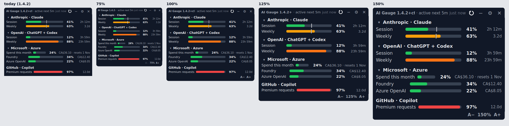
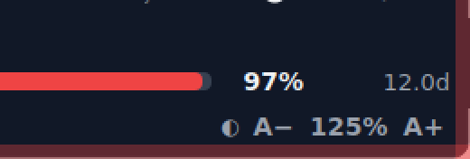

# Zoom (text size) for the floating panel — research

**Status:** research for the 1 November 2026 review. Nothing here is built.
**Asked for:** "a toggle bottom-right for zoom that increases/decreases font sizes overall"
(the maintainer, 2026-10-02).
**Read with:** [`theme-toggle.md`](theme-toggle.md) — the two controls sit together and share
their first PR — and [`../ui-scale-widget-only-plan.md`](../ui-scale-widget-only-plan.md), the
unbuilt plan this recommends finishing.
**Measured against:** `main` at `5f09a55`, 1.4.2+cfa.10. Qt runtime 6.11.2, PyQt6 6.11.0, Python
3.11. Anything marked **verified** was run offscreen on a `git archive` export with a prototype
patch. Line numbers are as of `5f09a55`. 1.4.3+cfa.11 has since moved `config.py` (by 8 to 38
lines from line 55 on) and two test files; the `widget.py`, `app.py` and `settings_dialog.py`
citations are unchanged.

*Today, then the prototype at 75 / 100 / 125 / 150%. Every prototype step has the new footer
(`A− A+`, with the percentage shown off 100%); the panel grows with the text, and at 100% it is
today's panel above that footer.*

## Summary

The toggle should be `docs/ui-scale-widget-only-plan.md`, finished and brought up to date, plus a
control. One zoom value — the existing `WindowState.ui_scale` — applied to the panel only, live,
through intrinsic `px()`/`qss()` scaling. The `QT_SCALE_FACTOR` path, its restart prompt and
`App.restart()` are removed.

The control is `A−  [125%]  A+` in a new footer row, inset clear of the resize band, with the
theme toggle beside it. Keyboard and Ctrl+wheel follow the usual conventions.

The prototype zooms live: a panel zoomed live renders **pixel-identical** to one built at that zoom
at every step tested, and at 100% it is pixel-identical to today above the new footer. 2 138 of
the 2 139 existing tests pass on it; the one that fails asserts the wheel step, which the
prototype changed on purpose.

## 1. What exists today

**The setting.**

- `WindowState.ui_scale: float = 1.0` (`config.py:253`), coerced to [0.75, 4.0] by
  `_coerce_bounds` (`config.py:262-285`): a non-number, a bool or a non-finite value becomes 1.0.
- `qt_scale_factor_env` (`config.py:1118-1129`) turns it into a string; `_apply_ui_scale_env`
  (`app.py:2923-2937`, called at `app.py:2952`) writes `QT_SCALE_FACTOR` before `QApplication`
  exists. An explicit environment value wins.
- Settings → General has a combo with 0.75/0.9/1.0/1.25/1.5/1.75/2.0/2.5/3.0/4.0 and the hint
  "applies after restart" (`settings_dialog.py:774-797`). `apply_to` sets `ui_scale_changed` and
  writes the value unconditionally (`:2190-2192`).
- `_on_settings_finished` asks "Restart to apply scale" (`app.py:2771-2782`). That prompt is the
  only caller of `App.restart()` (`app.py:2659-2683`), and `restart()` is the only user in `app.py`
  of `subprocess` (`:9`) and `autostart_command` (`:45`).
- Tests that would change: `test_config.py:24, 337-352, 909-910`, `test_app_logging.py:1933`, and
  the wheel-step assert at `test_widget.py:2549`.

**The plan, checked against today.** Its mechanism is right — the prototype shows that — but every
citation in it is stale, and it predates 1.4.0:

| Plan says | Today |
|---|---|
| `config.py:209` `qt_scale_factor_env`, `:77` field | `:1118`, `:253` |
| `app.py:1028/1057/801/895` | `:2923/2952/2659/2771` |
| `settings_dialog.py:421-442, 991-993` | `:774-797, :2190-2192` |
| `widget.py:60-63` constants | `:68-76` |
| `config.py:18-21` `WINDOW_*` | `:40-55` |
| `WINDOW_MAX_HEIGHT` | `WINDOW_AUTOFIT_MAX_HEIGHT` |
| "Width is no longer constant" is the main risk | Already happened in 1.4.0; `WINDOW_WIDTH` is a first-run size and readers use `self.width()` |
| "Persist actual px or baseline: decide" | Decided below — baseline, on new evidence |
| "First cut: re-create the widget" | Rejected (§3) |

The plan does not cover the resize band, `user_sized` and the `_commit_geometry` seam, the
`_app_geometry` depth guard, the work-area cap, eliding headers, the 58/92/240 reset column, the
stale-`fontMetrics` trap (§5), the non-modal Settings clobber (§7), the position migration (§5), or
shortcuts.

**Inventory.** `grep -rno "font-size: *[0-9]*px" src/` gives 47 hits; the setter counts come from
`python3 docs/research/zoom/inventory.py src/aigauge/widget.py`.

| What | Count | Where |
|---|---|---|
| `font-size:Npx` literals | **47** — 31 in `widget.py`, 9 `ratio_dialog`, 3 `cookie_dialog`, 2 `error_dialog`, 2 `settings_dialog` (10px×28, 11px×16, 12px×2, 13px×1 across the tree) | dialogs must **not** scale |
| `setPixelSize` | 1 (`_SummaryChip`, 11) | scale |
| Other stylesheet px in `widget.py` | 7 `border-radius:3px`, 1 `padding:0 8px` | scale |
| Geometry setters with literal or constant arguments in `widget.py` | **51**, the script's total (it also counts the `setPixelSize` above, and `QSize(16,16)` apart from `setIconSize`) — 12 `setContentsMargins`, 10 `setSpacing`, 9 `setFixedWidth`, 3 `setFixedHeight`, 3 `setFixedSize`, 3 `setGeometry`, 2+1+2+2 min/max, 1 `setIconSize`/`QSize(16,16)`, 1 `setMinimumSize(260,80)` | scale, except `_QT_SIZE_MAX` resets and zero margins |
| Inline numbers | `_MetricRow`: label min 70, pct 34, reset 58 / 92 / 190 / `_RESET_LABEL_MAX_WIDTH` 240, +4 (`:1016-1043`); grouped label +4 (`:1663`); `_CompactMetric` 10/30×6/28/38; chip 18+4, +18; mini buttons 20×20 at 13px; refresh icon 16; expand 16×16; sign-in 20; `_ElidingLabel.MIN_WIDTH` 48; pace pens 4/2; chip wrap spacing 5 and margin 16 | scale |
| Module constants | `ROW_BAR_HEIGHT` 8, `PACE_TICK_OVERHANG` 2, `CHIP_NOTCH_*` 4/3.5; `WINDOW_WIDTH` 340, `WINDOW_DEFAULT_HEIGHT` 220, `WINDOW_MIN_WIDTH` 260, `WINDOW_MIN_HEIGHT` 80, `WINDOW_AUTOFIT_MAX_HEIGHT` 420, `WINDOW_COLLAPSED_HEIGHT` 58 | scale at use; store unscaled |

## 2. Qt mechanisms (verified offscreen unless marked)

- **The panel must not carry a stylesheet.** A stylesheet on a parent cascades into a child
  `QDialog` (a 30 px rule reached a dialog label), and Settings, Error details and Ratio history
  are all parented to the panel (`app.py:2690, 2618, 2649`). The comment at `widget.py:1762` says
  the same.
- **`setFont` does not work.** It stops at a child top-level window, which is good, but a label's
  own QSS `font-size` beats it. Fractional px is rounded (`font-size:10.5px` comes out as 11), so
  the zoom works in integer px.
- **Half-up rounding, not `round()`.** `round()` is banker's: 12.5 → 12, so at 125% the 10 px text
  would land on 12 instead of 13. Use `int(n*z + 0.5)`.
- **`QT_SCALE_FACTOR` scales the coordinate space as well as sizes.** At 1.5 the 800 px screen
  becomes **533×533** logical px. Saved sizes are therefore already "unscaled", but saved x/y are in
  the shrunken space (§5). The factor is latched at `QApplication` construction, so it cannot change
  live.
- **Shortcuts.** `QKeySequence.StandardKey.ZoomIn` is only `Ctrl++`; `Ctrl+=` matches
  Key_Equal+Ctrl; Ctrl+Shift+Key_Plus matches only `Ctrl+Shift++`; the keypad modifier is ignored,
  so Ctrl+keypad± match. Two `QShortcut`s with the same sequence are ambiguous and neither fires,
  so register distinct sequences. The default `WindowShortcut` context fires only while the panel
  is the active window — a Ctrl+= typed into a Settings field did not zoom the panel. The frameless
  `Tool` window is active after `show()`. *Unverified:* the Windows layout key mapping for Shift+=,
  and macOS `Ctrl` → ⌘ (Qt's documented swap).
- **Ctrl+wheel.** Over a `QScrollArea` viewport, Ctrl+wheel **page-scrolls** and accepts the event:
  148 px against 60 for a plain notch on a default scroll area, and 174 px against 126 in the
  panel's tile area at 340×200, so zoom has to intercept it in the panel's existing
  read-only `eventFilter`, which `_track_hover` already installs on every child. Wheel events go to
  the window under the pointer, so no activation is needed.
- **min > max.** Qt keeps both, and `resize()` honours the minimum (a 500 min on a 400 max gave
  500). A zoomed floor must be capped at the work area first.
- *Unverified:* a trackpad pinch (`QNativeGestureEvent`) on macOS. Optional.

## 3. What the toggle is, and what happens to `ui_scale`

**Decision: the plan, built.** `ui_scale` stays the one stored value; the toggle and Settings both
edit it; it applies only to the panel, live.

Rejected:

- **A second multiplier beside `QT_SCALE_FACTOR`** — two knobs that compound (UI scale 150% × zoom
  120%), dialogs still scaled, and a restart for one of them.
- **A −/+ that changes `QT_SCALE_FACTOR`** — a restart per click.
- **`QGraphicsView`/proxy** — rejected for the plan's own reasons, and the resize-band hit-testing
  would go through a proxy.
- **Re-creating the panel per step** — it flickers, re-wires the App's signals, and loses a press in
  flight.
- **Fonts only, geometry fixed** — at 150% "100%" bold needs 53 px against the 34 px column, and
  "23h 59m" needs 67 against 58 (measured), so the fixed text columns clip.

**Users who have it set.** At 1.0 nothing changes. At ≠ 1.0 the panel looks the same size: a 150%
panel zoom against today's `QT_SCALE_FACTOR` 1.5 is near-identical (11 px text rounds to 17 rather
than rendering 16.5, so rows are about 1 px taller). Settings, the tray menu, message boxes and the
sign-in browser go back to OS size — the plan's stated goal, which the CHANGELOG should say. Saved
x/y need a one-time conversion (§5). Values of 2.5, 3.0 and 4.0 clamp to the new 2.0 ceiling (Q2).

## 4. What scales, what doesn't

**Scale with the zoom:** every item in §1 except the dialogs — fonts, text columns, buttons, icons,
bars and pace ticks, chips and notches, margins and spacings, the 260 floor, the 80 minimum height,
the 58 collapsed minimum, the 420 auto-fit ceiling, and the wheel step (three lines of *zoomed*
text; `ui_style.wheel_step` today measures the scroll area's app font).

**Do not scale:** `RESIZE_BAND` 8 (the pointer target native frameless windows use); the window's
8 px corner radius and 1 px border (`paintEvent`); the 10 px scroll bars (shared with Settings, and
a pointer target); the 1 px chip border; tooltips (app font); the tray icon and menu-bar pixmap;
every dialog; gesture timings.

**Font ladder** (today's 10/11/12/13 px):

| Zoom | Sizes |
|---|---|
| 75% | 8/8/9/10 — 10 and 11 merge; acceptable at the floor |
| 90% | 9/10/11/12 |
| 110% | 11/12/13/14 |
| 125% | 13/14/15/16 |
| 150% | 15/17/18/20 |
| 175% | 18/19/21/23 |
| 200% | 20/22/24/26 |

**Pre-existing, not caused by zoom:** `_CompactMetric`'s 28 px percentage clips "100%" (31 px) and
its 38 px reset column clips "23h 59m" (45 px) at 100% on Linux fonts. Scaling keeps the clip;
deriving text columns from `fontMetrics` would fix it but changes the 100% layout, so it is a
follow-up.

## 5. Live application, and the window

**What has to re-run**, found by building it (`zoom/prototype-widget.diff`, +420/−89 including
duplication a real build would not have):

1. **Static sizes.** The constructor's styling and sizing moves into a per-class `_apply_zoom()` on
   `UsageWidget`, `_ProviderTile`, `_MetricRow`, `_CompactMetric`, `_DetailLine`, `_PaceProgressBar`
   and `_ElidingLabel`; children receive `zoom` as a constructor argument.
2. **Data-dependent styles.** Each tile re-renders from `_latest_snapshot` via `set_snapshot` —
   status colours, the chunk colour, the 58/92/240 rule, grouped label widths. The ratio label
   re-renders too.
3. **`ensurePolished()` before every `fontMetrics`-derived width** (`widget.py:1659`, `:1019`,
   `:1030`). Without it, a label whose stylesheet has just changed measures with the previous font:
   grouped labels sized 81 px for a 116 px "Azure OpenAI" at 150%, shown as "Azure Ope". With it, a
   live zoom and a freshly built panel went from 450–4 327 px different to **0 px different** at
   75/100/125/150/200. Today this is masked only because 11 px is smaller than the 12 px app font.
4. **The chip strip** is rebuilt every second anyway (the 1 Hz tick at `:1932` →
   `_refresh_collapsed_summary`), so new chips pick up the zoom; only the wrap spacing and margin
   need scaling.
5. **Eliding labels.** `_ElidingLabel` and `_DetailLine` re-elide on resize, and a zoom always
   changes the width. They should also re-elide on `FontChange`/`StyleChange` for when the work
   area pins the width (unverified).
6. **The window:** minimum size, auto-fit (called synchronously, with the footer's height added),
   screen bounds, `_track_hover` for new rows, the refresh icon pixmap re-rendered at the new size.

A round trip of 100 → 125 → 150 → 200 → 75 → 100% returned the auto-fitted panel to exactly its
starting size.

**Window rules** (verified; `docs/research/zoom/roundtrip.py <patched-tree>`, recipe in its header):

- **Stored sizes are 100% units; on screen they are stored × zoom.** An auto-fitted panel opens at
  340×z wide and its height re-fits; a hand-sized panel scales proportionally, so what is visible
  stays the same, only larger. The model's width bound [260, 4096] stays correct; sizes saved under
  `QT_SCALE_FACTOR` are already in these units.
- **A zoom step never rewrites the stored size.** The prototype's first cut lost it: at 200% the
  work-area clamp cut a 400×500 window to 800×800, and on the way back 400×400 was saved. The fix:
  `_remember_size` writes only after a resize the app did not make, detected by
  `_is_user_geometry()` in `resizeEvent` or by the fallback delta (the clamp and auto-fit already run
  behind `_app_geometry`). Result: 400×500 at (100,100), zoomed through 200% and back, returns to
  400×500 at (100,100).
- **Gravity anchoring.** On each axis, keep the edge nearer the work area's edge, decided once after
  the user last moved the window so a run of steps cannot flip it mid-way. A panel docked
  bottom-right above the Windows tray keeps its bottom-right corner — (780,706) at every step — so
  its A+ stays under the pointer. A panel docked top-right keeps (780,20). The macOS popover keeps
  its top-centre anchor, and `_app_positioned` still stops the anchor being saved.
- **Floor = `ceil(260 × z)`, capped at the work-area width.** The measured header hard floor (where
  the "just now" label or ✕ starts losing pixels; `docs/research/zoom/floor.py`, one process per
  step) stays below it at every step, by 8 px at 75%, 15 px at 90%, and 17–35 px from 100% up:

| Zoom | 75 | 90 | 100 | 110 | 125 | 150 | 175 | 200 |
|---|---|---|---|---|---|---|---|---|
| Floor (px) | 195 | 234 | 260 | 286 | 325 | 390 | 455 | 520 |
| Measured hard floor (px) | 187 | 219 | 240 | 264 | 308 | 364 | 429 | 485 |

- **Position migration.** For `ui_scale ≠ 1` only: multiply saved x/y by `ui_scale` once, recorded
  by a new bool. Otherwise a panel saved at (400,300) under 1.5 opens somewhere else.
- **Prerequisite — fixed in 1.4.3+cfa.11.** `WindowState.x` and `.y` (`config.py:233-234` at
  `5f09a55`) were unbounded `int | None`: `"x": 1e12` loaded without complaint, and
  `QPoint(config.window.x, ...)` at `widget.py:1924` raised `OverflowError` inside `App()`
  (`app.py:757`), so the app failed at every start until the file was fixed. They are now coerced on
  load to ±32 767 (`WINDOW_MAX_POSITION` and `WindowState._coerce_position` in `config.py`), and a
  malformed value reads as "never placed". The migration above multiplies them by `ui_scale`, so it
  must pass the product back through the same bound: `WindowState` has no `validate_assignment`.

## 6. The control

*The footer at 125%: the theme toggle (a placeholder ◐, drawn for this render only; the committed
diff does not include it) and `A− 125% A+`, with the 8 px resize band drawn in red. No footer pixel
touches it.*

**Where it can live.** The 8 px band covers every edge and corner, bottom-right included, and a
button over it would take the press the corner resize needs. The panel has no footer today.

- **Header — rejected.** The title already clips at 340 ("AI Gauge 1.4.2+c…"); the header's hard
  floor is 240, and two more 20 px buttons would push it past 260.
- **Hover overlay — rejected.** It covers the last row's reset column.
- **Inside the collapsed chip rows — rejected.** They are deleted and rebuilt every second, so a
  press on a button there is lost.
- **Footer row — recommended.** Under the tile area, right-aligned, inset `RESIZE_BAND + 2` on the
  right and `RESIZE_BAND` at the bottom, both **unscaled**. Verified: no footer pixel is in the band
  at any of the eight steps. It costs 20 px at 100% (266 → 286: a 24 px footer minus the tile
  area's 4 px bottom margin), and 20–40 px across the range.

**Look.** `A−  125%  A+`, 11 px semibold `#9ca3af`, hover `#f3f4f6`, dimmed at the bounds. "A"
because the header's collapse button is already "−" and the strip's expand is "+", so a bare −/+
would collide. The percentage shows only when the zoom is not 100%, and clicking it resets.
Tooltips: "Smaller text (Ctrl+−)", "Larger text (Ctrl+=)", "Text size, click to reset (Ctrl+0)".
The theme toggle sits immediately left of the cluster.

**Collapsed strip:** no control. The value is shared with the expanded panel, and keyboard and
Ctrl+wheel work there (Q3). **macOS popover:** the same footer, anchored top-centre. **Tray menu:**
no entries, to keep it short.

**Keyboard and wheel.** Zoom in: `Ctrl+=`, `Ctrl++`, `Ctrl+Shift++`, `Ctrl+Shift+=`. Zoom out:
`Ctrl+-`. Reset: `Ctrl+0`. Ctrl+wheel accumulates to ±120 per step (three 40-unit trackpad deltas
make one step); a plain wheel is unchanged.

**Steps and bounds:** 75, 90, 100, 110, 125, 150, 175, 200%. From an off-ladder value a step goes
to the next ladder value. Each step commits through `_commit_geometry`, which is dirty-checked, so
one atomic write per step and none at a bound.

## 7. Interactions

- **Auto-fit, remembered size, the 260 floor and the band:** §5 and §6.
- **Settings dialog.** It stays OS-sized (verified: field font 12 px after a panel zoom). It is
  **non-modal**, so `apply_to`'s unconditional write would put the combo's stale value back over a
  zoom made on the panel meanwhile. Write `ui_scale` only if the combo changed, then call
  `widget.set_zoom()`. No restart.
- **`ColorThresholds`.** The scaling helper touches only `<int>px`, so band colours pass through
  unchanged; the renders confirm it.
- **Embedded sign-in browser and tray:** no longer scaled.

**What the theme feature needs from this** (and see `theme-toggle.md` §6): the footer row and its
left slot; one **restyle seam**, the one `theme-toggle.md` §6 names — `styled()` renders every inline
stylesheet from colour tokens and zoomed px, and `restyle_all()` re-renders them, calls each panel
class's `_restyle()` (this document's per-class `_apply_zoom()`), then re-delivers each tile's
snapshot, so `set_zoom` and `set_theme` both end in `restyle_all()`; colour tokens for the footer
buttons; no panel-level stylesheet; one shared decision for the collapsed strip. Both refactors
rewrite the same 34 stylesheet calls in `widget.py`, so they share a first PR: `theme-toggle.md` §9
PR 1 (the helper, `restyle_all()`, per-class `_restyle()`, dark tokens at zoom 1.0, no visible
change). The zoom mechanism and the light theme follow in either order.

## 8. Security mandate

- **New config:** none for the zoom itself. `ui_scale` keeps its coercion and its bound narrows to
  [0.75, 2.0]. The panel clamps again at use, because `WindowState` has no `validate_assignment`.
- **One new bool** for the one-shot x/y migration, coerced like `user_sized`: anything not a real
  bool reads as False. A re-conversion is harmless because x/y are bounded to ±32 767 on load
  (1.4.3+cfa.11) and clamped on screen.
- **Stylesheets:** the helper emits `<int>px` from our own literals times a clamped float. No config
  text reaches a stylesheet.
- **Fewer moving parts:** the `subprocess.Popen` relaunch and the process-environment write are
  both removed.
- No dependency, no network, writes only `config.json` via `atomic_write`, and logs carry no account
  data.

## 9. Test plan

Rules, not Linux pixel counts; they hold on offscreen CI and on the real-platform Windows leg.

1. **Config.** `ui_scale`: −3 → 0.75, 99 → 2.0, NaN or True → 1.0; migration-bool coercion; x/y
   converted exactly once, and a converted value stays within ±32 767.
2. **Helpers.** Scaling helpers round half-up, never below 1, 0 stays 0, colours untouched.
3. **Live = built.** At every ladder step, a panel zoomed live equals one constructed at that zoom,
   field by field — each label's `fontInfo().pixelSize()`, every fixed width, size hints, window
   size. Fonts follow `half_up(base × z)`.
4. **Floor.** At the minimum width, at each step, the header controls are fully visible, measured
   from live metrics.
5. **Band.** No footer pixel satisfies `edges_at`, at every step.
6. **Window.** Auto-fit width is 340×z; a hand-sized round trip through 200% (clamped on the
   800×800 screen) restores size and position; a zoom never changes the stored size; gravity
   anchoring holds; the popover anchor is not saved; the floor is capped at the work area.
7. **Input.** Every key sequence works, with no duplicates; Ctrl+= in a Settings `QLineEdit` does
   not zoom; Ctrl+wheel over the tile viewport zooms and does not scroll, and trackpad deltas
   accumulate; the wheel step is three zoomed lines.
8. **Persistence.** One write per step, none at a bound; Settings OK with an unchanged combo keeps
   the panel's zoom; a changed combo applies live with no prompt; `main()` no longer sets
   `QT_SCALE_FACTOR`.
9. **Regressions.** Grouped labels at 150% are at least their text width (the `ensurePolished`
   case); the Settings font is unchanged by a zoom; every existing widget test passes unchanged —
   the prototype holds this except the wheel-step rule, updated deliberately.

## 10. Recommended design

The plan, built on today's code: `ui_scale` becomes a panel-only, live zoom, and the
`QT_SCALE_FACTOR` path, the restart prompt and `restart()` are deleted.

- **Control and input:** an `A− [n%] A+` cluster right-aligned in a new footer, clear of the 8 px
  band, with the theme toggle beside it; Ctrl+= / Ctrl+− / Ctrl+0 and Ctrl+wheel; eight steps,
  75–200%.
- **Scaling and window:** uniform scaling of everything except pointer targets and window chrome;
  sizes stored in 100% units and never rewritten by a zoom; the panel grows or shrinks
  proportionally and stays docked to its nearer corner; the floor is 260×z, capped at the work area;
  saved x/y converted once for users with `ui_scale ≠ 1`.
- **Settings:** the "UI scale" row becomes a live "Text size" combo on the same ladder, written only
  if it was changed.

## 11. Open questions for the maintainer

1. **Does the panel grow with the text?** *Default: yes, proportionally* — it stays docked, and the
   old size comes back exactly. The alternative keeps your dragged size, so the tiles scroll and the
   text columns crowd.
2. **Is 75–200% enough?** *Default: yes.* A saved UI scale of 250–400% opens at 200%.
3. **Controls on the collapsed strip as well?** *Default: no* — keyboard and Ctrl+wheel still work
   there, and one value covers both views.
4. **Keep the Settings row?** *Default: keep it, renamed "Text size", applied live.*

## 12. Effort and risk

| PR | Contents | Size | Effort |
|---|---|---|---|
| **0** (shared, first) | `theme-toggle.md` §9 PR 1: `styled()`, `restyle_all()`, per-class `_restyle()`, dark tokens at zoom 1.0, no visible change | ≈ 600 lines, ~10 tests | 1 session |
| **B** (mechanism, no new UI) | `widget.py` ≈ +260/−110; `config.py` ≈ +30/−15; `app.py` ≈ +10/−50; `settings_dialog.py` ≈ +10/−8; ~25 new and ~6 edited tests; CHANGELOG; retire the plan doc | 6 files | 1–1.5 sessions |
| **C** (control) | Footer, cluster, shortcuts, Ctrl+wheel, wheel step | ≈ +130 lines, ~12 tests | 0.5 session; the theme toggle lands in this footer |

The prerequisite x/y bound (§5) shipped separately in 1.4.3+cfa.11.

**Most likely to go wrong:** the commit-seam change ("remember only sizes the user made") touches
1.4.0's most-tested code; a missed literal (test 3 catches it structurally); stale `fontMetrics`; on
a real Windows desktop, Shift+= mapping, zoom × OS 150% composition, and the native
`startSystemResize` path that offscreen never takes; the macOS popover, unverified here.

## Files in `docs/research/zoom/`

- `sheet-steps.png`, `footer-band-z125.png` — the two images in this document.
- `inventory.py` — the setter counts in §1.
- `floor.py` — the measured header floor per step in §5.
- `roundtrip.py` — the window round trip in §5.
- `prototype-widget.diff` — the prototype the pixel comparisons were measured on, against
  `5f09a55`; evidence, not code to merge.
